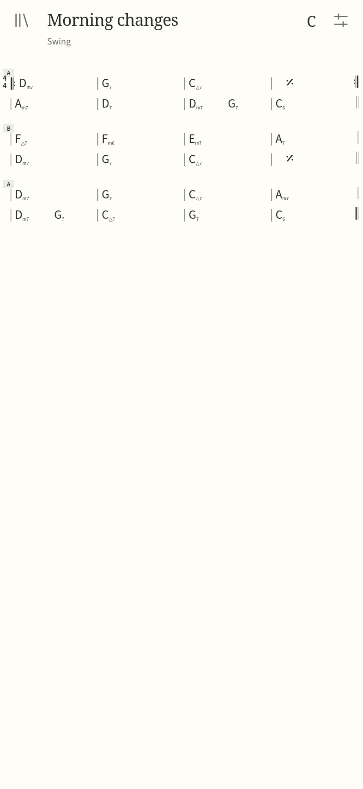
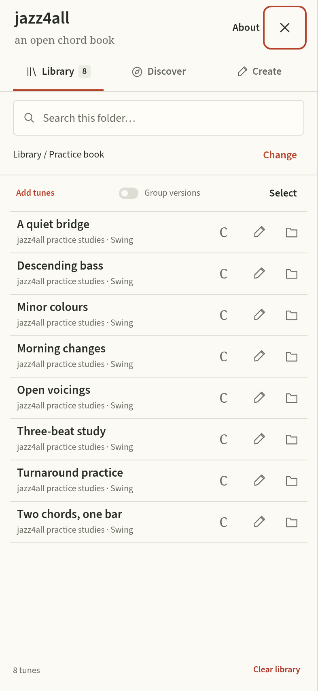

# jazz4all

**an open chord book**

Read, write and organize chord charts on your phone, tablet or computer.
jazz4all puts the sheet first: a full-screen reading view, transposition
without hiding the chords, and a library that stays on your device.

It works as a standalone web app/PWA and as an Android app. No account,
advertising, analytics or playback. **Tunes are not packaged with the app; they are downloaded by the user.**
You can also write your own charts or import playlists.

<p>
  
  
</p>

## What it does

- Read charts offline; transpose, resize and switch between day/night themes.
- Write chords with a live preview, named sections, repeats and mixed meters.
- Organize tunes in nested folders and choose a destination before importing.
- Import iReal Pro HTML exports or paste `irealb://` links.
- Export individual charts, a selection, a whole folder or your library to a file.
- Search titles/composers and group different versions of a tune.
- Download selected community collections when you request them.

Charts you create remain editable. Imported charts can be read and transposed.
Your web and Android libraries are separate. Export tunes to keep a copy or
transfer them between devices. Clearing app data deletes the local library.

The app respects your privacy: your library stays on your device, with no
accounts or tracking. There are no known security issues at this time.

## Try the web app

Clone the repository and run the local server with Python 3.10 or newer:

```sh
git clone https://github.com/AlexandreCampo/jazz4all.git
cd jazz4all
python3 scripts/serve-web.py
```

Open **http://127.0.0.1:8001/**. No frontend build or npm install is needed.
Use `--port 8002` if that port is already taken. The preview serves the application files.

To publish the web version, run `python3 scripts/export-web.py` and deploy
`dist/web/` to an HTTPS static host. See [web deployment](docs/web-deployment.md)
for subdirectory hosting, PWA installation and offline behavior.

## Android

Android 7.0 or newer is required. Signed APKs belong on the project's
[Releases page](https://github.com/AlexandreCampo/jazz4all/releases) when available.
For building, signing and installing from source, see [android/README.md](android/README.md).
F-Droid packaging is prepared; inclusion is not yet approved.

## Documentation

| Guide | Covers |
| --- | --- |
| [Using jazz4all](docs/usage.md) | Reading, folders, import/export, chord entry and shortcuts |
| [Development](docs/development.md) | Setup, architecture and working on the app |
| [Tests](tests/README.md) | Unit, browser, native and APK checks |
| [Web deployment](docs/web-deployment.md) | Static export, HTTPS hosting and PWA support |
| [Releases](docs/releases.md) | Versioning, source archives, signing and distribution |
| [F-Droid](packaging/fdroid/README.md) | Recipe, submission steps and signing choices |
| [Privacy](PRIVACY.md) | How the app respects your privacy |

## Repository layout

```text
index.html, manifest.webmanifest, sw.js   Web/PWA entry points
src/                                    Application modules, styles and fonts
vendor/                                 Third-party parser, renderer and music font
data/                                   Community catalog metadata, never tunes
icons/                                  Web application icons
android/                                Native wrapper and Gradle build
packaging/fdroid/                        Repository metadata and submission notes
fastlane/                               Store descriptions, icon and screenshots
scripts/                                Preview, export, tests and font tooling
tests/                                  Unit, browser, native and APK checks
docs/                                   User and maintainer guides
licenses/                               Complete third-party license texts
```

The Android build bundles the same web sources. There is no separate frontend
implementation to maintain. Node and Playwright are development/test tools only.

## Contributing and license

See [CONTRIBUTING.md](CONTRIBUTING.md) for setup, review expectations and
AI-assisted development disclosure. Bug reports and focused changes are welcome.

Copyright © 2026 Alexandre Campo. Licensed under the
[GNU General Public License, version 3 or later](LICENSE) (`GPL-3.0-or-later`).
Third-party code and fonts keep their own licenses; see
[THIRD_PARTY_NOTICES.md](THIRD_PARTY_NOTICES.md).

The parser/renderer builds on the work of Michael Daumling and Florin
Alexandrescu. jazz4all is independent of Technimo LLC and iReal Pro.
